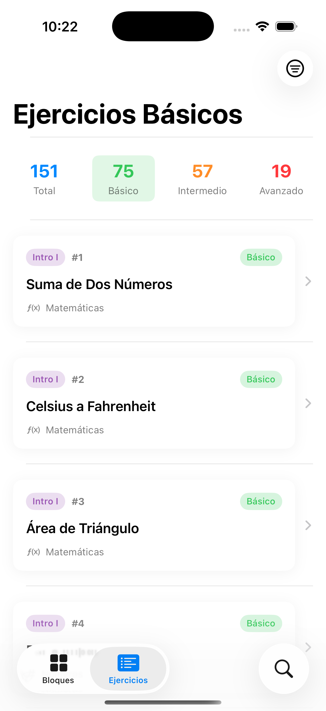
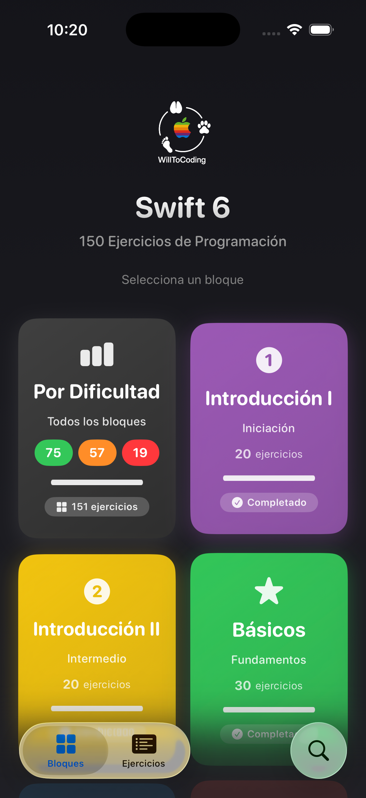
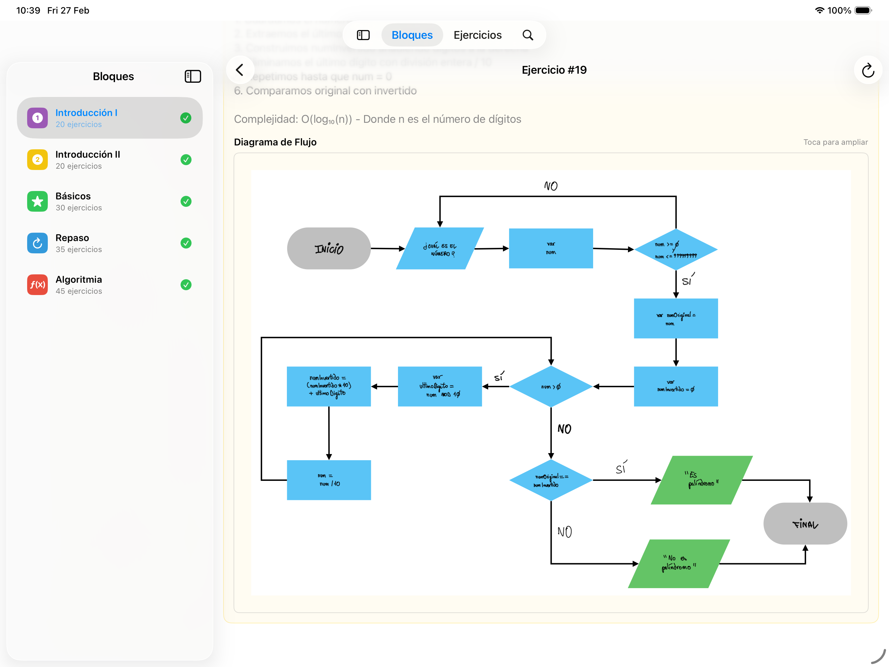
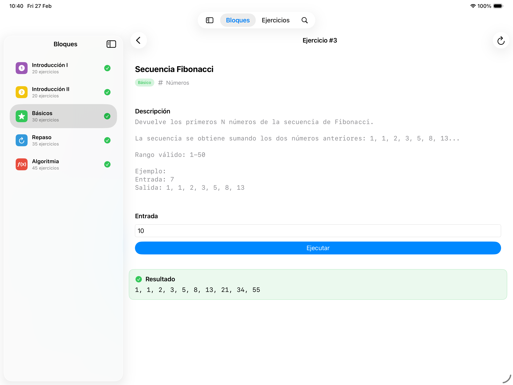
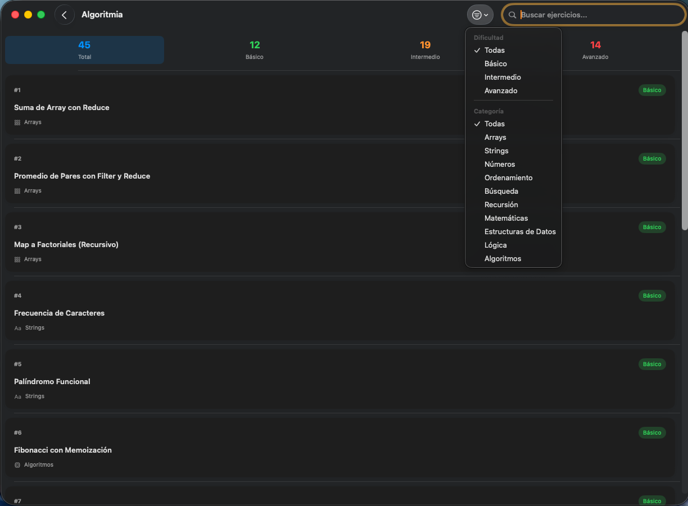
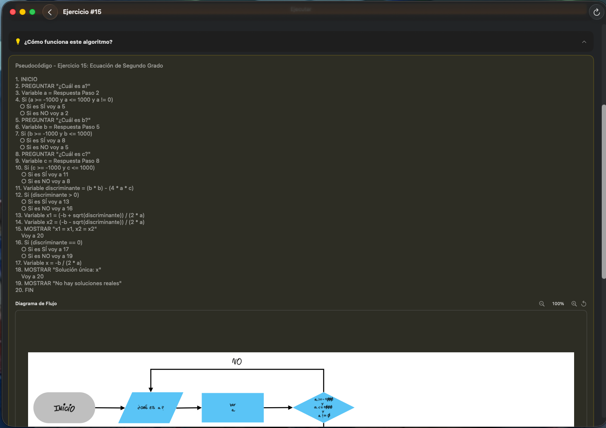
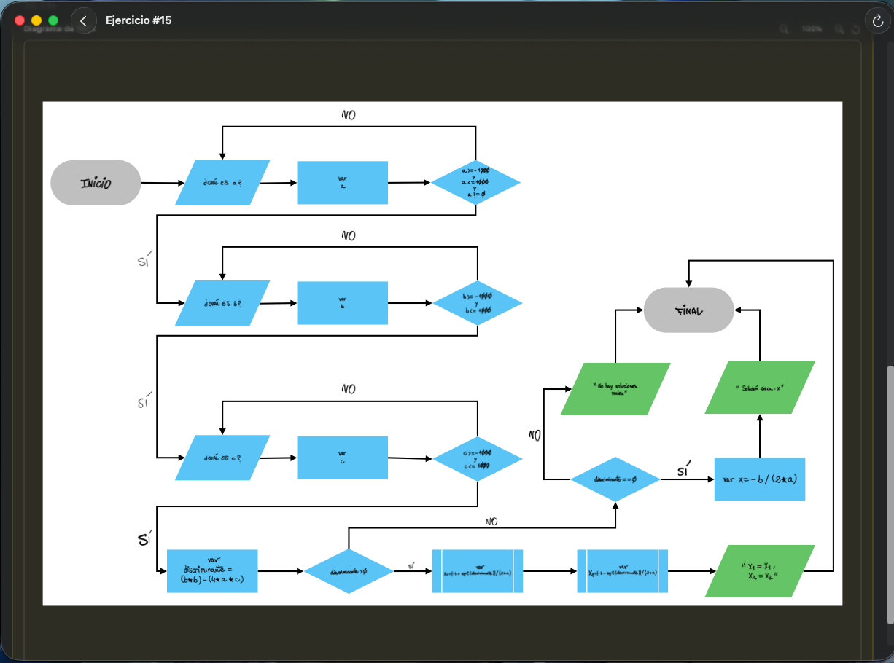

# Ejercicios

<p align="center">
  
</p>

<h3 align="center">150+ Swift algorithm exercises for all Apple platforms</h3>

<p align="center">
  
  
  
  
</p>

<p align="center">
  <b>Swift Developer Program 2025 — Apple Coding Academy</b><br>
  <i>From basics to advanced algorithms with visual diagrams</i>
</p>

---


| | Feature | Description |
|:--:|---------|-------------|
| 📚 | **150+ Exercises** | Comprehensive algorithm collection |
| 📱 | **Multi-platform** | iPhone, iPad, Mac native apps |
| 📊 | **Flow Diagrams** | Visual algorithm representation |
| 🧩 | **Code Blocks** | Structured pseudocode view |
| ▶️ | **Live Execution** | Run and test solutions in-app |
| 🔍 | **Filtering** | Search by category and difficulty |

---


<p align="center">
  
  &nbsp;&nbsp;&nbsp;
  
</p>

- Compact exercise list with categories
- Code blocks with syntax highlighting
- Adaptive layout for all iPhone sizes

---


<p align="center">
  
  &nbsp;&nbsp;&nbsp;
  
</p>

- Split view navigation
- Full-size flow diagrams
- Side-by-side code and execution

---


<p align="center">
  
  &nbsp;&nbsp;&nbsp;
  
</p>

<p align="center">
  
</p>

- 3-column NavigationSplitView
- Advanced filtering by category
- Keyboard shortcuts: `⌘F` search, `⌘R` run

---


| Category | Count | Topics |
|:--------:|:-----:|--------|
| **Básicos** | 30+ | Variables, tipos, operadores |
| **Condicionales** | 25+ | if, switch, guard |
| **Bucles** | 30+ | for, while, repeat |
| **Arrays** | 25+ | Colecciones, map, filter, reduce |
| **Funciones** | 20+ | Parámetros, closures, recursión |
| **Algoritmia** | 20+ | Ordenación, búsqueda, optimización |

---


### Flow Diagrams

```
┌─────────────┐
│   START     │
└──────┬──────┘
       ▼
┌─────────────┐
│  Input N    │
└──────┬──────┘
       ▼
   ┌───────┐
  ╱ N > 0? ╲───No──▶ "Invalid"
  ╲        ╱
   └───┬───┘
      Yes
       ▼
┌─────────────┐
│ Calculate   │
└──────┬──────┘
       ▼
┌─────────────┐
│   Output    │
└──────┬──────┘
       ▼
┌─────────────┐
│    END      │
└─────────────┘
```

### Pseudocode Blocks

```
ALGORITHM CalculateFactorial
    INPUT: n (integer)
    OUTPUT: result (integer)

    IF n < 0 THEN
        RETURN error
    END IF

    result ← 1
    FOR i ← 1 TO n DO
        result ← result × i
    END FOR

    RETURN result
END ALGORITHM
```

---


| Category | Technologies |
|:--------:|-------------|
| **Language** | Swift 6 |
| **UI** | SwiftUI |
| **Architecture** | MVVM + Clean Architecture |
| **Concurrency** | async/await, @MainActor |
| **Observation** | @Observable (iOS 17+) |
| **Data** | Codable JSON |

---


| Platform | Version |
|:--------:|:-------:|
| iOS | 17.0+ |
| iPadOS | 17.0+ |
| macOS | 14.0+ |
| Xcode | 16+ |

---


```bash
git clone https://github.com/WillToCoding/Ejercicios.git
cd Ejercicios/Ejercicios-iOS
open Ejercicios-iOS.xcodeproj
```

Select your target platform and run with `⌘R`.

---


```
Ejercicios/
├── 📱 Ejercicios-iOS/
│   ├── Views/
│   │   ├── ExerciseListView.swift
│   │   ├── FlowDiagramView.swift
│   │   ├── PseudocodeView.swift
│   │   └── ExecutionView.swift
│   ├── ViewModels/
│   │   └── ExerciseViewModel.swift
│   ├── Models/
│   │   └── Exercise.swift
│   └── Resources/
│       └── exercises.json
├── 🖼️ snapshots/
│   ├── iOS/
│   ├── iPad/
│   └── macOS/
└── 📄 README.md
```

---


| Project | Description |
|:-------:|-------------|
| [**EjerciciosUIs**](https://github.com/WillToCoding/EjerciciosUIs) | 5 SwiftUI interface exercises |
| [**MisMangas**](https://github.com/WillToCoding/MisMangas) | Multi-platform manga collection manager |
| [**NetworkAPI**](https://github.com/WillToCoding/NetworkAPI) | Async/await networking layer |

---

<p align="center">
  <b>MIT License</b> · Made with ❤️ by <b>Juan Carlos</b>
</p>

<p align="center">
  <i>Swift Developer Program 2025 — Apple Coding Academy</i>
</p>
