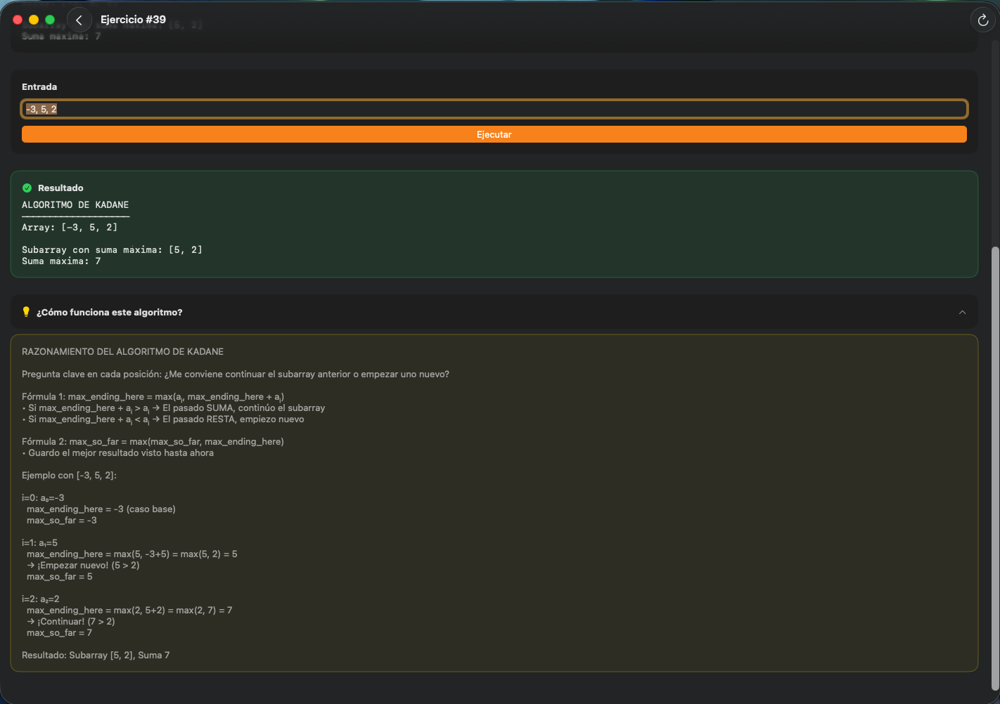

# Ejercicios

<p align="center">
  
</p>

<h3 align="center">150+ Swift algorithm exercises for iPhone, iPad & Mac</h3>

<p align="center">
  
  
  
  
</p>

<p align="center">
  <b>Swift Developer Program 2026 — Apple Coding Academy</b><br>
  <i>From basics to advanced algorithms with visual diagrams</i>
</p>

---


| | Feature | Description |
|:--:|---------|-------------|
| 📚 | **150+ Exercises** | From basics to advanced algorithms |
| 📊 | **Flow Diagrams** | Visual algorithm representation |
| 🧩 | **Pseudocode** | Structured code blocks view |
| 💡 | **Explanations** | Step-by-step reasoning for complex exercises |
| ▶️ | **Live Execution** | Run and test solutions in-app |
| 🏷️ | **Categories** | Organized by difficulty and topic |

---


| Block | Exercises | Topics |
|:-----:|:---------:|--------|
| **Introducción 1** | 20 | Entradas/salidas, condiciones, bucles simples |
| **Introducción 2** | 20 | Condicionales anidados, bucles anidados, búsqueda |
| **Nivel Básico** | 30 | Primos, Fibonacci, palíndromos, MCD, ordenamiento |
| **Repaso** | 35 | Tipos, bucles, structs, clases, closures, herencia |
| **Algoritmia** | 45 | Recursión, divide y vencerás, programación dinámica |

---


**20 ejercicios de iniciación** — Fundamentos de algoritmia con diagramas de flujo y pseudocódigo. Desde operaciones básicas hasta bucles con números primos, Fibonacci, factoriales, palíndromos y cálculo del MCD/MCM.

| Category | Exercises | Highlights |
|:--------:|:---------:|------------|
| **Entradas/Salidas** | 1-3 | Suma, Celsius→Fahrenheit, área triángulo |
| **Condiciones** | 4-6 | Par/impar, aprobado/suspenso, signo número |
| **Bucles Simples** | 7-20 | Fibonacci, factorial, primos, MCM, MCD, pirámides |

---


**20 ejercicios intermedios** — Anidación de estructuras de control y algoritmos matemáticos avanzados. Incluye raíz cuadrada por Newton-Raphson, ecuaciones de segundo grado y la fórmula de Zeller para calcular días de la semana.

| Category | Exercises | Highlights |
|:--------:|:---------:|------------|
| **Condicionales Anidados** | 1-3 | Triángulos, calificaciones A-F, días del mes |
| **Bucles Anidados** | 4-6 | Tablero ajedrez, rombo, tablas multiplicar |
| **Contadores/Acumuladores** | 7-9 | Pares/impares, divisibles por 3, suma cuadrados |
| **Funciones Matemáticas** | 10-20 | Raíz Newton-Raphson, bisiesto, Zeller, edad |

---


**30 ejercicios de Swift 6** — Implementación práctica de algoritmos clásicos. Desde detección de primos hasta cifrado César, pasando por ordenamiento burbuja, búsqueda binaria, criba de Eratóstenes y conversión de números romanos.

| Category | Exercises | Highlights |
|:--------:|:---------:|------------|
| **Números** | 1-10 | Primos, Fibonacci, factorial, MCD, binario |
| **Strings & Arrays** | 11-20 | Palíndromos, anagramas, frecuencias, burbuja |
| **Algoritmos Clásicos** | 21-30 | Búsqueda binaria, Eratóstenes, romanos, Levenshtein |

---


**35 ejercicios de repaso** — Consolidación de fundamentos Swift: tipos primitivos, estructuras de control, POO con clases y structs, herencia, closures, propiedades lazy y observadores willSet/didSet.

| Category | Exercises | Highlights |
|:--------:|:---------:|------------|
| **Fundamentos** | 1-7 | Tipos, operadores, bucles, arrays, diccionarios |
| **POO: Clases & Structs** | 8-19 | Vehiculo, Circulo, Pelicula, Vector, CarritoDeCompras |
| **Herencia & Polimorfismo** | 20-26 | Subclases, Usuario, Hospital, Personaje (juego) |
| **Avanzado** | 27-35 | Closures, lazy, willSet/didSet, enums con valores |

---


**45 ejercicios avanzados** — Algoritmos complejos con enfoque funcional: recursión con memoización, MergeSort, QuickSort, programación dinámica, backtracking y un mini intérprete de expresiones aritméticas.

| Category | Exercises | Highlights |
|:--------:|:---------:|------------|
| **Arrays & Strings** | 1-10 | reduce, filter, map, Fibonacci memoizado |
| **Recursión & Ordenamiento** | 11-20 | Búsqueda binaria, MergeSort, Triángulo Pascal |
| **Problemas Clásicos** | 21-30 | Permutaciones, Levenshtein, cifrado César |
| **Recurrencia & Dinámica** | 31-40 | Armstrong, QuickSort, Kadane, números Catalán |
| **Retos Avanzados** | 41-45 | Cambio monedas, paréntesis válidos, intérprete |

---


<p align="center">
  
  &nbsp;&nbsp;&nbsp;
  
</p>

- Exercise list organized by categories
- Pseudocode blocks with syntax highlighting
- Adaptive layout for all iPhone sizes

---


<p align="center">
  
  &nbsp;&nbsp;&nbsp;
  
</p>

- Split view navigation for large screens
- Full-size flow diagrams
- Side-by-side code and execution

---


<p align="center">
  
  &nbsp;&nbsp;&nbsp;
  
</p>

<p align="center">
  
  &nbsp;&nbsp;&nbsp;
  
</p>

- 3-column NavigationSplitView
- Filtering by category
- Detailed reasoning explanations

---


**Swift Testing** for exercise validation.

```swift
@Suite("Exercise Tests")
struct ExerciseTests {
    @Test("Fibonacci sequence")
    func fibonacci() {
        #expect(fibonacci(10) == [1, 1, 2, 3, 5, 8, 13, 21, 34, 55])
    }
}
```

---


| Category | Technologies |
|:--------:|-------------|
| **Language** | Swift 6 |
| **UI** | SwiftUI |
| **Architecture** | MVVM + Clean Architecture |
| **Concurrency** | async/await, @MainActor |
| **Observation** | @Observable |
| **Testing** | Swift Testing |
| **Data** | Codable JSON |

---


| Platform | Version |
|:--------:|:-------:|
| iOS / iPadOS | 26.2+ |
| macOS (Tahoe) | 26.3+ |
| Xcode | 26.2+ |

---


```
Ejercicios-iOS/
├── 📱 Ejercicios-iOS/
│   ├── ExercisesApp.icon
│   ├── Interface/
│   ├── Views/
│   ├── Components/
│   ├── ViewModels/
│   ├── Repository/
│   ├── Models/
│   ├── Resources/
│   ├── System/
│   └── Assets.xcassets
├── 🖥️ Ejercicios-Mac/
└── 🧪 Ejercicios-iOSTests/
```

---


```bash
git clone https://github.com/WillToCoding/Ejercicios.git
cd Ejercicios
open Ejercicios-iOS.xcodeproj
```

Select your target platform and run with `⌘R`.

---


| Project | Description |
|:-------:|-------------|
| [**EjerciciosUIs**](https://github.com/WillToCoding/EjerciciosUIs) | 5 SwiftUI interface exercises |
| [**MisMangas**](https://github.com/WillToCoding/MisMangas) | Multi-platform manga collection manager |
| [**NetworkAPI**](https://github.com/WillToCoding/NetworkAPI) | Async/await networking layer |

---

<p align="center">
  <b>MIT License</b> · Made with ❤️ by <b>Juan Carlos</b>
</p>

<p align="center">
  <i>Swift Developer Program 2026 — Apple Coding Academy</i>
</p>
