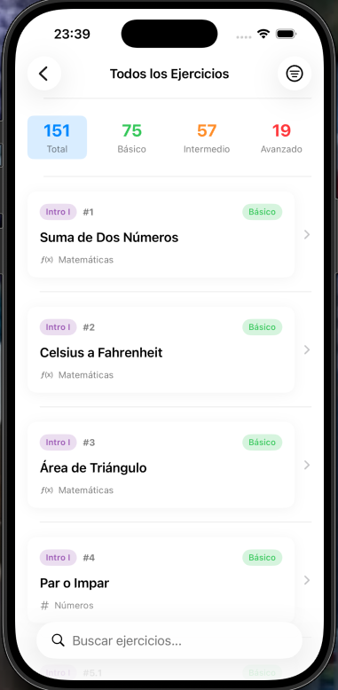
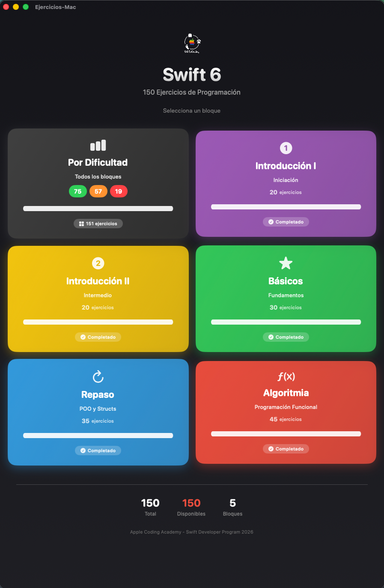

#  Swift 6 - 150 Ejercicios de Programación

Aplicación **iOS, iPadOS y macOS** con **150 ejercicios interactivos** de algoritmia y programación en Swift 6, diseñada como herramienta de aprendizaje y práctica.

<p align="center">
  
</p>

<p align="center">
  
  &nbsp;&nbsp;&nbsp;
  
</p>

## Descripción

Esta aplicación permite practicar y ejecutar ejercicios de programación directamente en el dispositivo. Cada ejercicio incluye:

- Enunciado del problema
- Campo de entrada para datos
- Ejecución en tiempo real
- Explicación del algoritmo (cuando aplica)
- Diagramas de flujo visuales

## Ejercicios Incluidos

### Resumen por Bloque

| Bloque | Ejercicios | Nivel |
|--------|------------|-------|
| Introducción I | 20 | Iniciación |
| Introducción II | 20 | Intermedio |
| Básicos | 30 | Básico |
| Repaso | 35 | Básico - Intermedio |
| Algoritmia | 45 | Intermedio - Avanzado |
| **Total** | **150** | |

---

### Introducción I - Iniciación (20 ejercicios)

Fundamentos de algoritmia y pensamiento lógico:

- **Operaciones básicas**: Suma, conversión Celsius/Fahrenheit, área de triángulo
- **Condicionales**: Par/impar, positivo/negativo, aprobado/suspenso
- **Bucles simples**: Números naturales, suma de N números, serie Fibonacci
- **Factorial y primos**: Cálculo de factorial, detección de primos, primos menores que N
- **MCM y MCD**: Mínimo común múltiplo, máximo común divisor
- **Palíndromos**: Verificación de números palíndromos
- **Geometría**: Distancia entre dos puntos, pirámide de asteriscos

---

### Introducción II - Intermedio (20 ejercicios)

Algoritmos con mayor complejidad:

- **Clasificación**: Tipos de triángulos, calificaciones escolares (A-F), días por mes
- **Patrones visuales**: Tablero de ajedrez, rombo de asteriscos, tablas de multiplicar
- **Contadores**: Pares/impares en rango, divisibles por 3, suma de cuadrados
- **Matemáticas**: Raíz cuadrada (Newton-Raphson), año bisiesto, valor absoluto
- **Ecuaciones**: Ecuación de segundo grado, potencias
- **Fechas**: Fórmula de Zeller (día de la semana), cálculo de edad
- **Juegos**: Adivina el número

---

### Básicos (30 ejercicios)

Problemas clásicos de programación:

- **Números primos**: Verificación, conteo en array, criba de Eratóstenes
- **Secuencias**: Fibonacci, números triangulares, números perfectos
- **Palíndromos**: Verificación de cadenas
- **Factorial**: Cálculo y suma de dígitos del factorial
- **Conjuntos**: Intersección, elementos comunes
- **Arrays**: Suma, filtrado, media aritmética, rotación
- **Diccionarios**: Almacenamiento clave-valor, frecuencia de letras
- **MCD y MCM**: Algoritmo de Euclides
- **Conversiones**: Decimal a binario, romanos a decimal
- **Ordenamiento**: Bubble Sort
- **Búsqueda**: Búsqueda binaria, segundo mayor elemento
- **Geometría**: Área y perímetro con fórmula de Herón
- **Criptografía**: Cifrado César
- **Anagramas**: Verificación de anagramas
- **Números de Armstrong**: Verificación
- **Producto escalar**: Operaciones con vectores
- **Distancia de Levenshtein**: Similitud entre cadenas
- **Subsecuencia creciente**: Encontrar la más larga

---

### Repaso - Básico a Intermedio (35 ejercicios)

Consolidación de conceptos con POO:

- **Tipos de datos**: Primitivos, variables, constantes, conversiones
- **Operadores**: Aritméticos, precedencia, módulo
- **Bucles**: for-in, repeat-while, while
- **Colecciones**: Arrays, diccionarios, conjuntos
- **Enumeraciones**: Meses, estaciones, switch exhaustivo
- **Clases y Structs**: Vehiculo, Circulo, Pelicula, Vector
- **Herencia**: PeliculaDigital, PeliculaEnDVD
- **Propiedades**: Calculadas, lazy, observadores (willSet/didSet)
- **Métodos**: Instancia, parámetros inout
- **Closures**: Captura de valores, funciones que retornan closures
- **Modelado**: CarritoDeCompras, Hospital, Sistema de juego (RPG)
- **Manejo de errores**: Enumeraciones de error, Result type
- **Conversiones**: Entero a número romano
- **Frecuencia de palabras**: Análisis de texto

---

### Algoritmia - Avanzado (45 ejercicios)

Algoritmos y estructuras de datos avanzadas:

#### Funciones de Orden Superior
- `reduce`: Suma de elementos
- `filter`: Filtrado de pares, primos
- `map`: Transformación a factorial, cuadrados

#### Recursión
- Factorial recursivo
- Fibonacci con memoización
- Búsqueda binaria recursiva
- MCD (Euclides)
- Potencia (divide y vencerás)
- Conjunto potencia (power set)

#### Ordenamiento y Búsqueda
- Merge Sort
- Quick Sort
- Búsqueda binaria
- Inserción binaria

#### Strings y Transformaciones
- Palíndromos (funcional)
- Frecuencia de caracteres
- Substring más largo sin repetidos
- Eliminación de duplicados
- Cifrado César
- Distancia de Levenshtein

#### Programación Dinámica
- Fibonacci con memoización
- Caminos únicos en cuadrícula
- Problema del cambio de monedas
- Algoritmo de Kadane (subarray suma máxima)

#### Matemáticas
- Criba de Eratóstenes
- Triángulo de Pascal
- Números de Armstrong
- Números Catalán
- Mediana

#### Estructuras de Datos
- Listas enlazadas (inversión recursiva)
- Diccionarios (frecuencia, mapeo)

#### Problemas Clásicos
- Two Sum
- Aplanar arrays anidados
- Permutaciones
- Combinaciones (n en k)
- Paréntesis balanceados (backtracking)
- Prefijo común más largo
- Conversión de base numérica

#### Parsing
- Mini intérprete aritmético (recursive descent)
- Tokenización
- Análisis sintáctico

---

## Tecnologías

| Tecnología | Versión |
|------------|---------|
| Swift | 6 |
| SwiftUI | iOS 17+ / macOS 14+ |
| Arquitectura | MVVM |
| Concurrencia | async/await, @MainActor |
| Observación | @Observable (iOS 17+) |

## Requisitos

- Xcode 15+
- iOS 17.0+ / iPadOS 17.0+ / macOS 14.0+
- Swift 6

## Instalación

```bash
git clone https://github.com/WillToCoding/Ejercicios-iOS.git
cd Ejercicios-iOS
open Ejercicios-iOS.xcodeproj
```

Selecciona el target (iOS o macOS) y ejecuta con `⌘R`.

## Arquitectura

```
Ejercicios-iOS/
├── Models/
│   ├── Exercise.swift         # Protocolo y wrapper
│   ├── Difficulty.swift       # Enum de dificultad
│   ├── Category.swift         # Enum de categorías
│   └── Exercises/             # Implementaciones por bloque
├── ViewModels/
│   ├── ExerciseListViewModel.swift
│   └── ExerciseDetailViewModel.swift
├── Views/
│   ├── BlockSelectionView.swift
│   ├── ExerciseListView.swift
│   ├── ExerciseDetailView.swift
│   ├── MainTabView.swift
│   └── iPad/              # Vistas optimizadas para iPad
│       ├── BlockSelectionViewiPad.swift
│       └── AllExercisesListViewiPad.swift
├── Components/
│   ├── Badges/
│   ├── Cards/
│   └── Sections/
└── Resources/
    └── *.json                 # Metadata de ejercicios
```

## Características

- Filtrado por dificultad (Básico, Intermedio, Avanzado)
- Filtrado por categoría (Matemáticas, Arrays, Strings, etc.)
- Búsqueda por título
- Ejecución interactiva de cada ejercicio
- Explicaciones con pseudocódigo
- Diagramas de flujo visuales
- Soporte nativo para iOS, iPadOS y macOS

### Experiencia iPad

- **NavigationSplitView** con sidebar de bloques
- **TabView adaptable** que se convierte en sidebar
- Interfaz optimizada para pantalla grande
- Navegación fluida entre bloques y ejercicios

## Autor

**Juan Carlos Morán Martín**

## Licencia

Este proyecto está bajo la Licencia MIT - ver el archivo [LICENSE](LICENSE) para más detalles.
